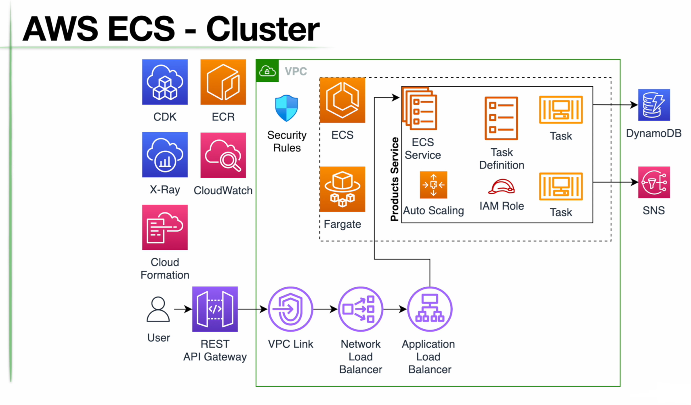
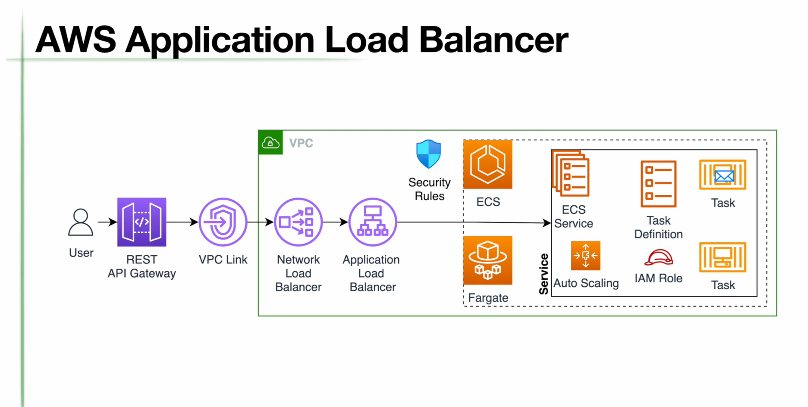
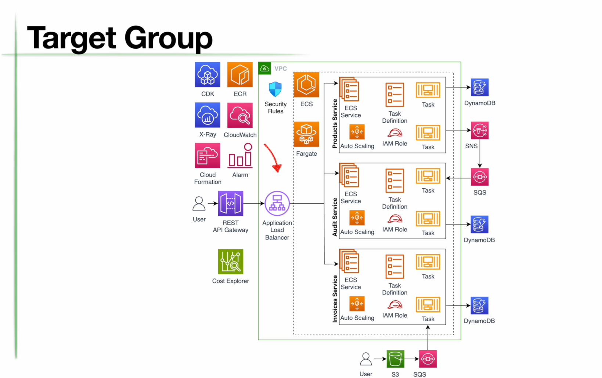

# Welcome to your CDK Java project!
# AWS ECS-Cluster

The `cdk.json` file tells the CDK Toolkit how to execute your app.

It is a [Maven](https://maven.apache.org/) based project, so you can open this project with any Maven compatible Java IDE to build and run tests.

## Useful commands

 * `mvn package`     compile and run tests
 * `cdk ls`          list all stacks in the app
 * `cdk synth`       emits the synthesized CloudFormation template
 * `cdk bootstrap --profile default --region ap-south-1` initializes the environment to support CDK deployments
 * `cdk deploy`      deploy this stack to your default AWS account/region
 * `cdk diff`        compare deployed stack with current state
 * `cdk docs`        open CDK documentation
 * `cdk deploy --all --profile default` destroys all stacks
 * `cdk deploy <stackname...>` deploys space separated stacks
 * `cdk destroy <stackname...>` destroys space separated stacks

# 12 Factor Methodology
The 12-Factor App is a methodology for building software-as-a-service applications that are scalable, maintainable, and portable. While it originally applied to web apps, the principles are highly relevant to microservices architectures. Here's a summary of each of the 12 factors:

## 1. Codebase
   One codebase tracked in version control, many deploys: A microservice should have a single codebase, managed in a version control system like Git. Multiple environments (staging, production) should all be derived from the same codebase.
## 2. Dependencies
   Explicitly declare and isolate dependencies: A microservice should declare all its dependencies (e.g., libraries, packages) in a manifest file (like pom.xml in Maven, build.gradle in Gradle, requirements.txt in Python). Dependencies should be isolated to avoid conflicts.
## 3. Config
   Store config in the environment: Configuration settings, such as database URLs or credentials, should be stored in environment variables, not in the codebase. This ensures that the same codebase can be deployed in different environments with different configurations.
## 4. Backing Services
   Treat backing services as attached resources: Services like databases, message brokers, and caching systems should be treated as external resources, connected via configuration, and easily replaceable without changing the code.
## 5. Build, Release, Run
   Strictly separate build and run stages: The process of building the application (compiling code, packaging) should be distinct from the release process (which involves adding configuration) and the run process (executing the application).
## 6. Processes
   Execute the app as one or more stateless processes: Microservices should be stateless; any data that needs to persist should be stored in external backing services (like databases). Each request should be independent and not rely on data stored in memory from previous requests.
## 7. Port Binding
   Export services via port binding: A microservice should be self-contained and expose its functionality over a network port. This allows it to be easily consumed by other services or users.
## 8. Concurrency
   Scale out via the process model: Microservices should be designed to scale horizontally by running multiple instances of the service, each in its own process.
## 9. Disposability
   Maximize robustness with fast startup and graceful shutdown: Microservices should start up quickly and shut down gracefully, allowing for rapid scaling, updates, and recovery from failures.
## 10. Dev/Prod Parity
   Keep development, staging, and production as similar as possible: The environments should be as similar as possible to reduce bugs and differences in behavior when deploying.
## 11. Logs
   Treat logs as event streams: Microservices should not concern themselves with log storage. Instead, they should write logs to stdout and rely on the environment to handle log aggregation and storage.
## 12. Admin Processes
   Run admin/management tasks as one-off processes: Tasks like database migrations, backups, or any other administrative work should be run as one-off processes, not as part of the regular app runtime.
   Summary
    

## Summary
#### The 12-Factor methodology provides a set of best practices that help ensure microservices are resilient, scalable, and maintainable. By adhering to these principles, teams can build microservices that are easy to deploy, scale, and manage, leading to a more reliable and flexible system.

Enjoy!
